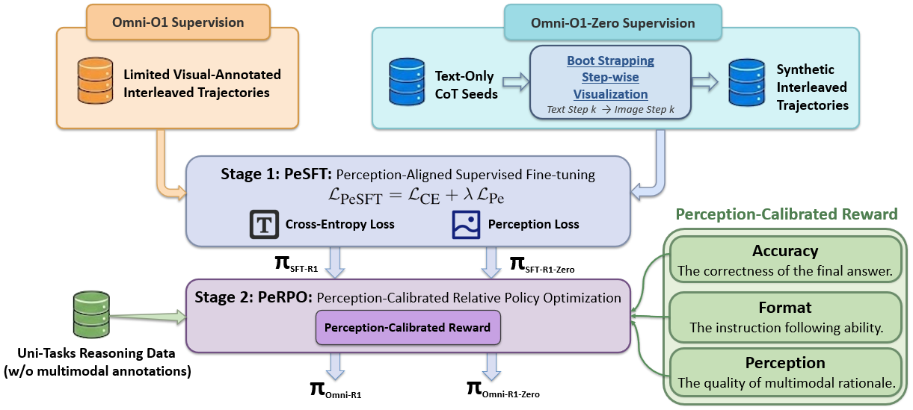

<a name="readme-top"></a>

<div align="center">
  <h1 align="center">Omni-R1: Towards the Unified Generative Paradigm for Multimodal Reasoning</h1>
</div>

<div align="center">
  <!-- Paper Link -->
  <a href="">
    
  </a>

  <!-- HuggingFace Models -->
  <a href="https://huggingface.co/charlesdj/Omni-R1">
    
  </a>
    
  <a href="https://huggingface.co/charlesdj/Omni-R1-Zero">
    
  </a>

  <!-- Omni-Bench Badge -->
  <a href="https://huggingface.co/datasets/charlesdj/Omni-Bench">
    
  </a>
    
</div>

---
Welcome to **Omni-R1**! 👋 This repository provides implementation code for *"Omni-R1: Towards the Unified Generative Paradigm for Multimodal Reasoning"*.

We instantiate this paradigm with Omni-R1, a two-stage SFT+RL framework featuring perception alignment loss and perception reward, thereby enabling functional image generation. Additionally, we introduce Omni-R1-Zero, which eliminates the need for multimodal annotations by bootstrapping step-wise visualizations from text-only reasoning data. 

### 🪐 Key Features
> [!IMPORTANT]
> Faster Evaluation & RL Rollouts with vLLM. Our evaluation and RL rollout pipelines are accelerated by vLLM, which can significantly reduce inference time of large-scale sampling and long rollouts.

🧭 **Two-stage training pipeline**  
PeSFT introduces perception alignment loss during SFT, and PeRPO applies a perception reward during RL to enhance functional image generation.

🌌 **Two training regimes under different supervision**  
Omni-R1 uses multimodal interleaved supervision, while Omni-R1-Zero bootstraps step-wise visualizations from text-only reasoning data.

🧩 **Benchmark**  
Includes Omni-Bench data and a vLLM-based evaluation script that runs inference efficiently and saves predictions in JSONL format.


## 🔥 News

<div style="max-height: 240px; overflow-y: auto;">

- **[2026.01]** 🎉 Initial code release of Omni-R1.

</div>


## 📑 Table of Contents <span id="table-of-contents"></span>
* <a href='#quick-start'>🚀 Quick Start</a>
  * <a href='#installation'>Installation</a>
  * <a href='#data'>Data</a>
  * <a href='#running'>Running</a>
* <a href='#training-pipelines'>🧪 Training Pipelines</a>
* <a href='#how-it-works'>✨ How It Works</a>
* <a href='#project-structure'>🗂️ Project Structure</a>
* <a href='#acknowledgements'>🌱 Acknowledgements</a>
* <a href='#citation'>📚 Citation</a>


## 🚀 Quick Start <span id="quick-start"></span>

### 1. Environment Setup <span id="installation"></span>

#### **Requirements for Inference & PeSFT**

```bash
python -m venv .venv
source .venv/bin/activate

pip install -U pip
pip install -r requirements.txt
pip install ./src/transformers
```

#### **Requirements for PeRPO**

```bash
git clone https://github.com/volcengine/verl && cd verl
# Follow the official docs to set up verl:
# https://verl.readthedocs.io/en/latest/start/install.html
```


### 2. Data Preparation <span id="data"></span>

#### **Required Datasets**

- **Omni-R1**: Zebra-CoT  
  https://huggingface.co/datasets/multimodal-reasoning-lab/Zebra-CoT

- **Omni-R1-Zero**: M3CoT  
  https://huggingface.co/datasets/LightChen2333/M3CoT
  
> [!NOTE]
> 🚧 **Bootstrapping step-wise visualization: Coming soon.**


### 3. Running <span id="running"></span>

#### **Evaluate on Omni-Bench with vLLM**

```bash
python Omni-Bench/vllm_eval.py \
  --parquet_path /path/to/omni-bench_cleaned.parquet \
  --model_path /path/to/your_model \
  --outfile preds.jsonl \
  --mm_images_per_prompt 5
```

#### **Inference with trained models**

Prepare the checkpoints, then run:

```bash
python src/Inference/inference.py \
  --input /path/to/data.jsonl \
  --output-dir /path/to/out \
  --model-path /path/to/chameleon_ckpt \
  --processor-path /path/to/processor_ckpt \
  --append-boi \
  --do-sample \
  --temperature 1.0 \
  --top-p 0.9
```

Resume / retry:

```bash
python src/Inference/inference.py \
  --input /path/to/jsonl_dir \
  --output-dir /path/to/out \
  --model-path /path/to/chameleon_ckpt \
  --append-boi \
  --resume --retry-errors
```

#### **PeSFT**

PeSFT requires a DeepSpeed config passed as a JSON string via `--deepspeed_config_json`.  
A minimal example:

```bash
DS_JSON='{
  "bf16": {"enabled": true},
  "zero_optimization": {"stage": 2},
  "train_micro_batch_size_per_gpu": 1,
  "gradient_accumulation_steps": 1
}'
```

```bash
deepspeed --num_gpus 8 src/PeSFT/pesft.py \
  --model_path /path/to/chameleon_ckpt \
  --output_path checkpoints/pesft_run \
  --json_dir /path/to/zebra_cot_jsonl \
  --deepspeed_config_json "$DS_JSON" \
  --learning_rate 1e-5 \
  --gradient_accumulation_steps 1 \
  --num_train_epochs 1 \
  --per_device_train_batch_size 1 \
  --mode templated   # for Omni-R1-Zero
  # --mode plain     # for Omni-R1
```

#### **PeRPO**
> [!TIP]
We will release the end-to-end training recipe as soon as possible after cleaning. You can build the recipe based on **verl**’s **DAPO** training pipeline, and directly reuse the reward functions in `src/PeRPO/rewards`.
Check the perception-calibrated reward implementation in:

```python
src.PeRPO.rewards
```


## 🧪 Training Pipelines <span id="training-pipelines"></span>

### Omni-R1
1. **Supervision Data**: Zebra-CoT  
2. **PeSFT**: perception-aligned supervised finetuning (`src/PeSFT/`)  
3. **PeRPO**: perception-calibrated relative policy optimization (built on verl) (`src/PeRPO/`)  

### Omni-R1-Zero
1. **Supervision Data**: start from M3CoT (text-only reasoning data), and bootstrap step-wise visualizations by calling the base anole model for each reasoning step. *(Code coming soon.)*  
2. **PeSFT + PeRPO**: same as Omni-R1  


## ✨ How It Works <span id="how-it-works"></span>

🪐 **Omni-R1** is built around a two-stage pipeline for generative multimodal reasoning, with each component corresponding to a well-defined stage in the overall method.  
A high-level overview is illustrated in the figure below.

<div align="center">
  <figure>
    
    <br>
    <figcaption><em>The framework of Omni-R1.</em></figcaption>
  </figure>
</div>

## 🗂️ Project Structure <span id="project-structure"></span>

```plaintext
.
├── omni-bench/
│   ├── omni-bench.parquet         # Benchmark dataset
│   └── vllm_eval.py               # vLLM inference / evaluation
│
└── src/
    ├── Inference/
    │   └── inference.py            # Chameleon inference
    │
    ├── PeRPO/
    │   └── rewards.py              # Perception reward utilities
    │
    ├── PeSFT/
    │   ├── perception.py           # Perception module
    │   ├── perception_module.ckpt  # Perception module checkpoint
    │   ├── pesft.py                # PeSFT training
    │   └── trainer.py              # Training utilities
    │
    └── transformers/
```

## 🌱 **Acknowledgements** <span id="acknowledgements"></span>

We would like to thank the contributors, open-source projects, and research communities whose work made **Omni-R1** possible. We also acknowledge helpful discussions and support from the members of Modality Dance Group.

<!-- Acknowledgement tags (badges) -->
[](https://github.com/GAIR-NLP/anole)
[](https://github.com/GAIR-NLP/thinking-with-generated-images)
[](https://iclr-blogposts.github.io/2025/blog/fine-tuning-token-based-large-multimodal-models/)
[](https://huggingface.co/datasets/multimodal-reasoning-lab/Zebra-CoT)
[](https://huggingface.co/datasets/LightChen2333/M3CoT)
[](https://github.com/huggingface/transformers)
[](https://github.com/volcengine/verl)
[](https://github.com/vllm-project/vllm)


This project is licensed under the **MIT License**. Please refer to the LICENSE file for more details.

## 📚 **Citation** <span id="citation"></span>

If you use **Omni-R1** in your research or applications, please consider citing:

```bibtex
@article{omnir1,
  title        = {Omni-R1: Towards the Unified Generative Paradigm for Multimodal Reasoning},
  author       = {},
  journal      = {arXiv preprint arXiv:{}},
  year         = {}
}
```
